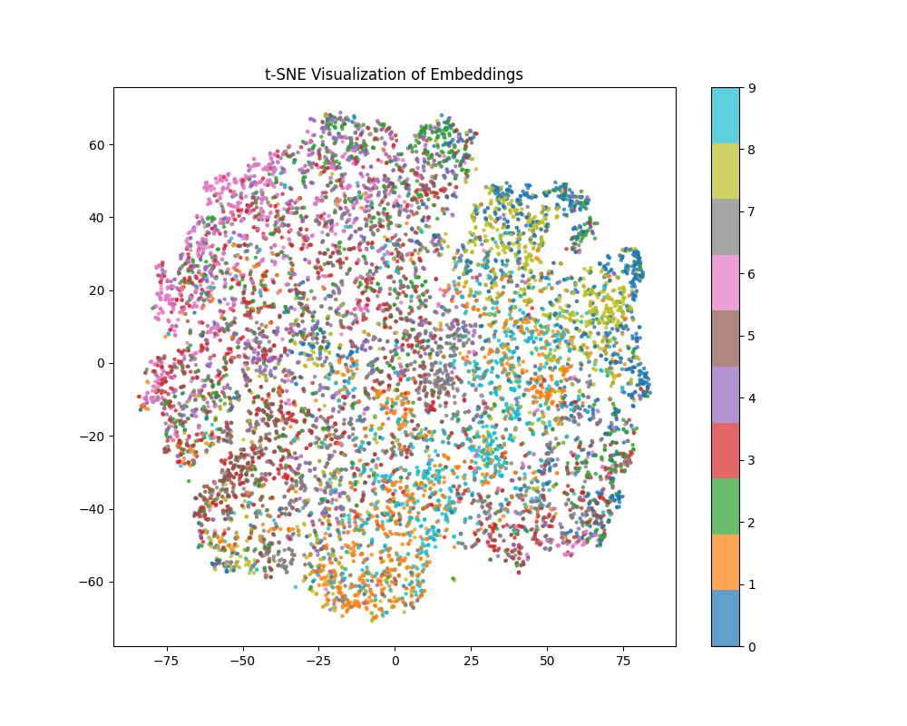
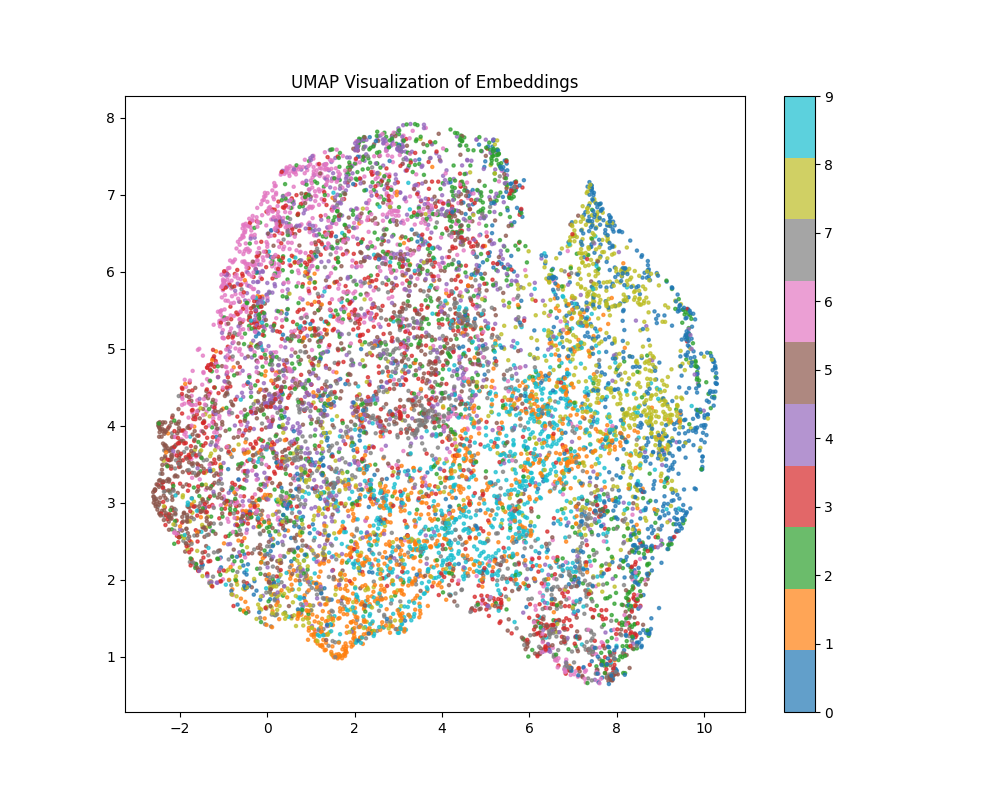

# Self-Supervised Learning with SimCLR on CIFAR-10

This repository implements **SimCLR** (contrastive self-supervised learning) with a **ResNet-18** backbone on **CIFAR-10**, and evaluates learned representations using the two standard SSL protocols:

1) **Linear Evaluation (frozen encoder)** → measures *representation quality*  
2) **Fine-tuning (end-to-end)** → measures *downstream performance when allowed to learn*

---

## 0) Installation and Setup

### Requirements
- Python >= 3.8
- PyTorch >= 1.11 and torchvision
- Additional dependencies (numpy, matplotlib, etc.) are in the `requirements.txt` file.

### Installation
```bash
# Clone the repository
git clone https://github.com/username/ssl-simclr-cifar10.git
cd ssl-simclr-cifar10

# Install dependencies
pip install -r requirements.txt
```

### Dataset Preparation
The CIFAR-10 dataset will be downloaded automatically if it is not found locally. Ensure you have a stable internet connection.

---

## 1) Repository Structure

To ensure smooth navigation, here is an overview of the folder structure:
```plaintext
src/  # Source code for training and evaluation
├── train_simclr.py      # SimCLR pretraining script
├── eval_linear.py       # Linear evaluation script
├── finetune.py          # Fine-tuning script
├── predict_images.py    # Generates per-image predictions
runs/                    # TensorBoard logs
results/                 # Plots and prediction outputs
├── figures/             # Linear evaluation and fine-tune results
├── predictions/         # Per-image CIFAR-10 test predictions
└── embeddings/          # Embedding visualizations (t-SNE, UMAP)
```

---

## 2) Experiments Overview

### A) Fine-tuning (10 epochs)
- **SimCLR-pretrained → fine-tune**
- **Scratch (random init) → fine-tune**

**What learns?** Encoder ✅ + classifier ✅  
**Why 10 epochs?** CIFAR-10 is small/easy, so end-to-end training converges quickly.

### B) Linear evaluation (30 epochs)
- **SimCLR-pretrained → linear eval**
- **Scratch → linear eval**

**What learns?** Encoder ❌ (frozen) + linear classifier ✅  
**Why 30 epochs?** Only one linear layer is trained, so convergence is slower → more epochs for stability.

---

## 3) Results and Insights

### Linear Evaluation (Frozen Encoder, 30 epochs)
| Model | Best Accuracy |
|------|--------------:|
| Scratch (random encoder) | 40.89% |
| **SimCLR-pretrained encoder** | **58.87%** |

**Gain from SSL (representation quality):** **+17.98 percentage points**

### Fine-tuning (End-to-End, 10 epochs)
| Model | Best Accuracy |
|------|--------------:|
| Scratch | **89.18%** |
| SimCLR-pretrained | 89.08% |

**Interpretation:** With end-to-end supervision on CIFAR-10, a scratch model can catch up quickly.  
This does **not** contradict SSL. Linear eval is the “pure” test of representation quality.

---

## 4) Embedding Visualizations (t-SNE and UMAP)

Qualitative assessments of learned representations are shown via embedding visualizations using **t-SNE** and **UMAP**. These plots illustrate the separability of features learned through SimCLR pretraining.

- **t-SNE Visualization:**
  

- **UMAP Visualization:**
  

These visualizations demonstrate how self-supervised learning clusters similar examples closer together in the feature space, giving a clear qualitative sense of representation quality.

---

## 5) Key Takeaways

- Self-supervised learning (SimCLR) learns transferable visual representations without labels.
- Linear evaluation clearly reveals representation quality better than fine-tuning accuracy alone.
- SimCLR-pretrained features are linearly separable and significantly outperform random features.
- Qualitative prediction analysis exposes failure modes hidden by aggregate metrics.
- Embedding visualizations (t-SNE and UMAP) demonstrate strong clustering of representations.
- Proper experimental baselines (scratch vs pretrained) are essential for meaningful evaluation.

---

## 6) How to Run the Code

```bash
# SimCLR pretraining
python -m src.train_simclr

# Linear evaluation
python -m src.eval_linear --mode pretrained
python -m src.eval_linear --mode scratch

# Fine-tuning
python -m src.finetune --mode pretrained
python -m src.finetune --mode scratch
```

---

## 7) Generating Prediction Visualizations

All qualitative results are generated using the `predict_images.py` utility.

### Linear Evaluation (Pretrained Encoder)
```bash
python -m src.predict_images \
  --mode linear_eval \
  --encoder_ckpt runs/simclr_cifar10/checkpoints/last.pt \
  --linear_ckpt runs/linear_eval/pretrained_linear_eval_resnet18/best_linear.pt \
  --n 16 \
  --seed 1 \
  --save_path results/predictions/linear_pretrained.png
```

### Notes
- `--n` controls the number of images shown
- `--seed` ensures reproducible image selection
- Images are always sampled from the CIFAR‑10 **test set**

---

## 8) TensorBoard Logs

All runs were logged to TensorBoard under the `runs/` directory. You can compare everything together:
```bash
tensorboard --logdir runs
```
Or view by experiment type:
```bash
tensorboard --logdir runs/linear_eval
tensorboard --logdir runs/finetune
```

---

This updated README reflects clarity, completeness, and usability for users new to the project, while retaining detailed coverage of the experiments and results.
